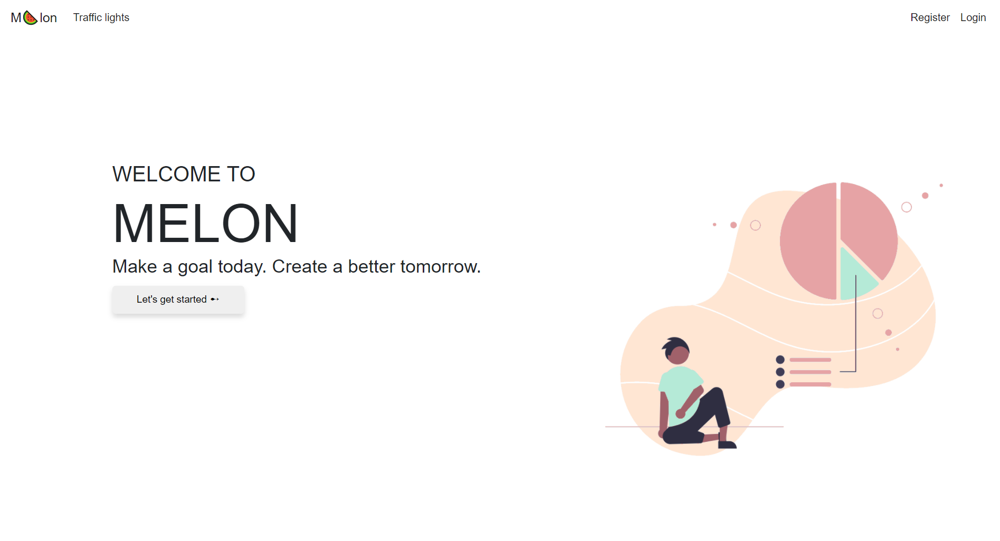
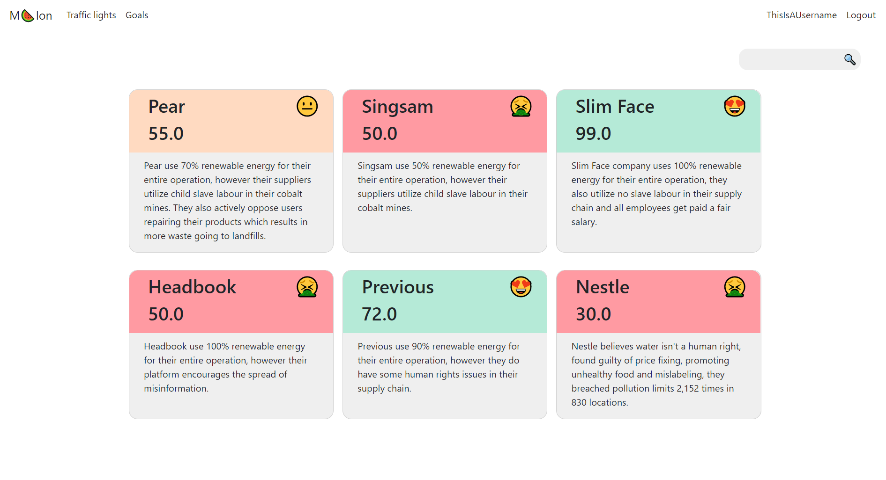
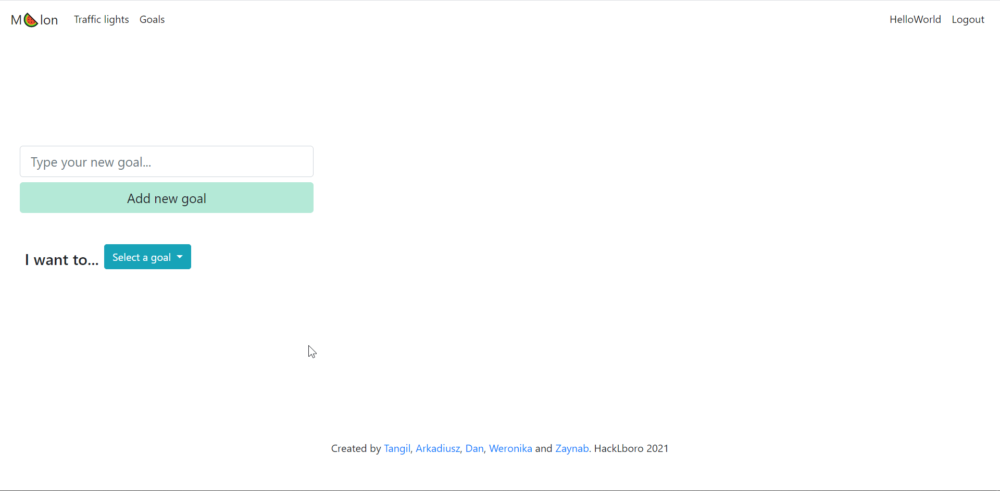
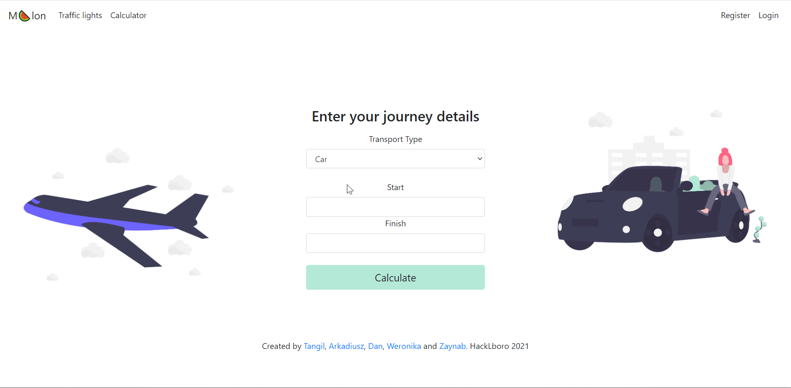

# Melon - HackLboro project

We, as a species, are producing more CO2 now than ever before. These emissions **need to stop**. We created **Melon** as
an easy way for people to track their emissions and make sure they're doing their part in saving the world. Little by
little, we can all make a **difference**.

## Screenshots









## Features

* Melon gives you **fast** and **accurate** data on companies and their practices. Instantly find out a company's energy
sources and their treatment of workers.
* Melon puts **you** in charge of your consumption and emissions. Intelligently track your goals to help make the
world a better place.
* Melon also provides an emissions calculator to inform you about your total emissions in a journey.
It has walking, cycling, bus, plane, car and train as transport options.

## Running

Make sure you have all the requirements with
```
pip install -r requirements.txt
```

Then run with
```
python hacklboro/main.py
```

Make sure your working directory is in the parent directory of the `hacklboro` folder.

## Built with
This would not have possible without these wonderful software projects.

* Python
* Flask
* Jinja2
* SQLite
* Passlib
* geopy
* HTML/CSS/JavaScript
* Bootstrap
* Mypy
* OpenStreetMap
